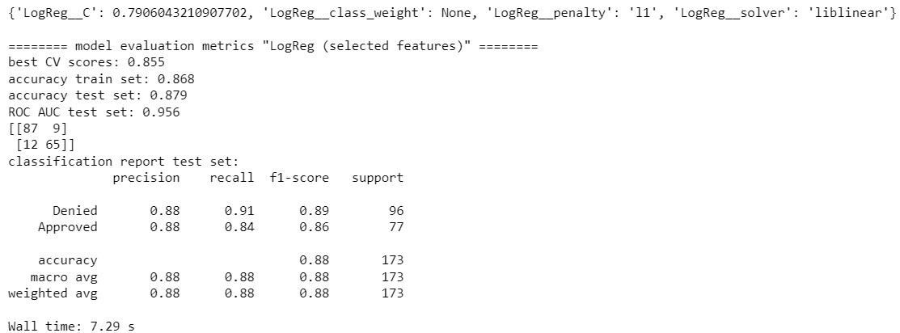
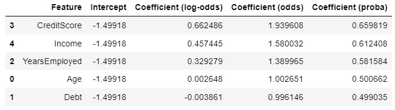
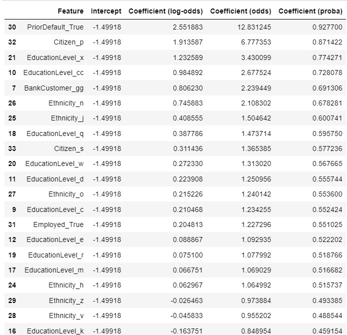
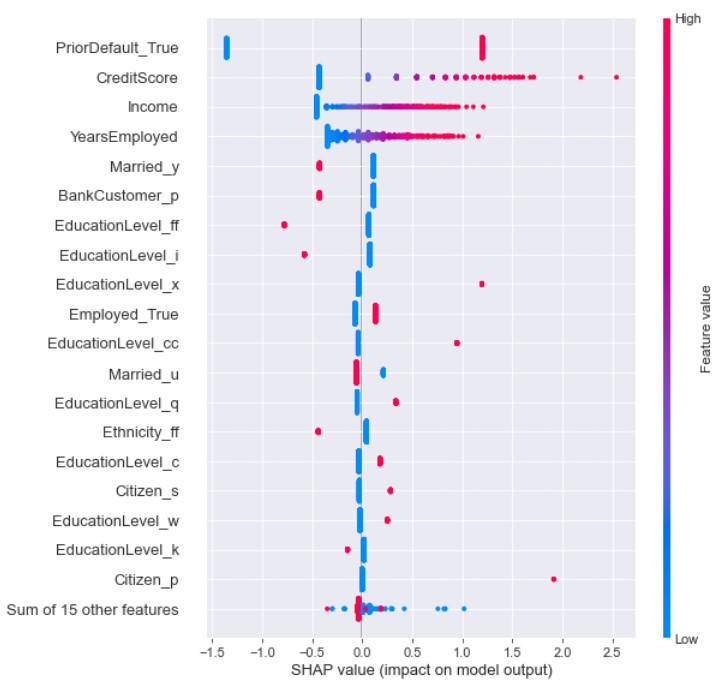
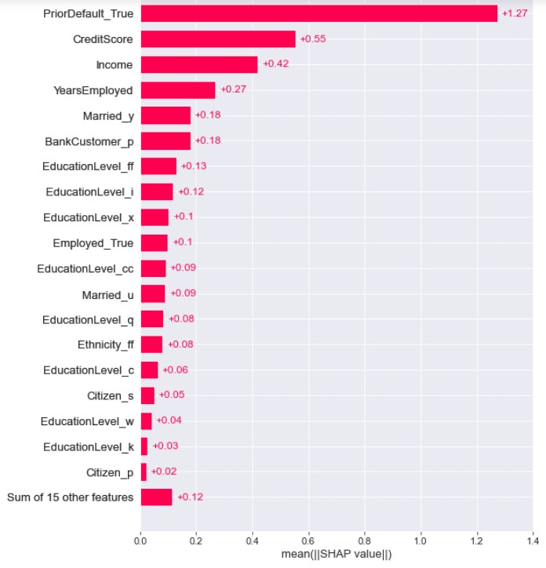

# Introduction
Nowadays, commercial banks receive a lot of applications for credit cards. Many of them get rejected for many reasons, like high loan balances, low income levels, or too many inquiries on an individual's credit report, for example. Manually analyzing these applications is mundane, error-prone, and time-consuming (remember time is money!). Luckily, this task can be automated with the power of machine learning and pretty much every commercial bank does so nowadays. In this project, we will try to build an automatic credit card approval predictor using machine learning technique, just like the real banks do. 

Essentially, predicting wheter a credit card application will be approved or not is a classification task. We will use a simple learning algorithm, i.e. Logistic Regression to predict the credit card approvals. Logistic Regression is pretty robust algorithm when we deal with linearly separable dataset. This model is also very easy to interpret.

## Objective
- To build a machine learning model to predict if a credit card application will get approved or not.
- To get some insights about the driver of approving credit card application.

## Business value
- We could help banks to predict credit card approval automatically.
- We could identify the reason of approving credit card application.

## Methodology
- Learning algorithm using Logistic Regression.
- Exploratory Data Analysis.

## The dataset
The dataset used in this project is the [Credit Card Approval dataset](http://archive.ics.uci.edu/ml/datasets/credit+approval) from the UCI Machine Learning Repository. This file concerns real world credit card applications. All attribute names and values have been changed to meaningless symbols to protect confidentiality of the data. This dataset is interesting because there is a good mix of attributes -- continuous, nominal with small numbers of values, and nominal with larger numbers of values. There are also a few missing values.

The features of this dataset have been anonymized to protect the privacy, but I found this [blog](http://rstudio-pubs-static.s3.amazonaws.com/73039_9946de135c0a49daa7a0a9eda4a67a72.html) is very useful because it gives us a pretty good overview of the expected name of anonymized features and its values.

Based on the blog mentioned above, the features that may exist in a typical credit card application are `Gender`, `Age`, `Debt`, `Married`, `BankCustomer`, `EducationLevel`, `Ethnicity`, `YearsEmployed`, `PriorDefault`, `Employed`, `CreditScore`, `DriversLicense`, `Citizen`, `ZipCode`, `Income` and finally the `ApprovalStatus`. These gives us a pretty good starting point, so we can map these features with respect to the columns in the original dataset.

Attribute information:
- `A1` as `Gender`: b, a.
- `A2` as `Age`: continuous.
- `A3` as `Debt`: continuous.
- `A4` as `Married`: u, y, l, t.
- `A5` as `BankCustomer`: g, p, gg.
- `A6` as `EducationLevel`: c, d, cc, i, j, k, m, r, q, w, x, e, aa, ff.
- `A7` as `Ethnicity`: v, h, bb, j, n, z, dd, ff, o.
- `A8` as `YearsEmployed`: continuous.
- `A9` as `PriorDefault`: t, f.
- `A10` as `Employed`: t, f.
- `A11` as `CreditScore`: continuous.
- `A12` as `DriversLicense`: t, f.
- `A13` as `Citizen`: g, p, s.
- `A14` as `ZipCode`: continuous.
- `A15` as `Income`: continuous.
- `A16` as `ApprovalStatus`: +,- (class attribute)

# Overview: final logistic regression model
## Model performance

## Coefficients
- Numerical feature coefficients

- Categorical feature coefficients

## SHAP values

# Conclusions
1. We have successfully built a machine learning model using Logistic Regression algorithm to predict if a credit card application will get approved or not. Even though we only use a simple linear model, the accuracy of this model is pretty good. This model has `87.9%` accuracy score and significantly outperform baseline accuracy score, `44.5%`. This model is trained using "selected features" train set and also has been tuned.
2. Based on the coefficients of Logistic Regression and the SHAP values, `CreditScore`, `Income`, and `YearsEmployed` are the most important numerical features and `PriorDefault_True` are the most important categorical feature. These four features positively affect the outcome and as these values increase, so does the probability and odds that a credit card application will be approved. These could be the main driver of approving credit card application by the auditors. Also these relationships make sense for us, so there is no something odd here.
3. Some of the features such as `Married`, `BankCustomer`, `EducationLevel`, `Ethnicity`, and `Citizen` are hardly to interpret since their value names are anonymized. But if we look at the SHAP values, some of those feature values give an impact on approving credit card application.
4. We also found that for those credit card applicants who haven't employed, their `CreditScore` values are `0`s. This tell us that their credit card approval are most likely to be denied by the auditor.
